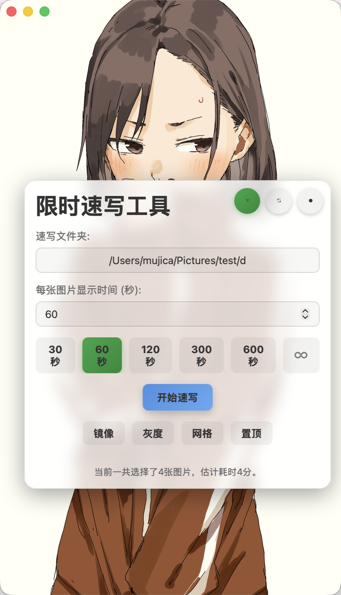
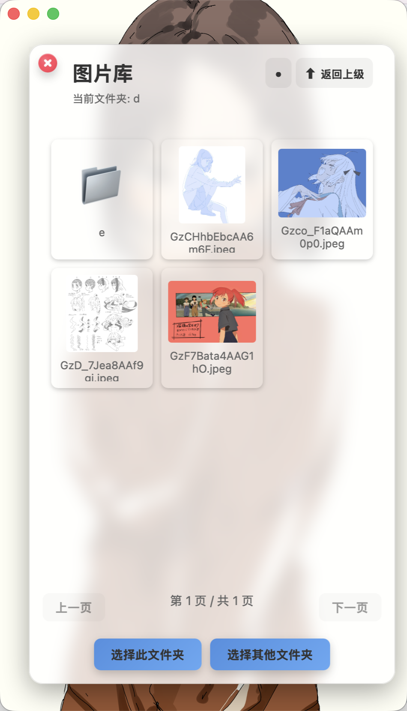

# SketchTool-Tuari

一个用于速写训练的桌面工具，当前版本基于 Tauri + Rust 重构，保留了原项目的核心使用方式，并针对 macOS 的窗口交互、图片轮播、平均色背景、网格和图片库体验做了适配。

## 截图

### 主界面



### 图片库



### 轮播倒计时界面


## 功能

- 选择本地图片文件夹开始速写训练
- 支持随机 / 顺序轮播
- 支持已标记图片过滤
- 支持图片库浏览、双击外部打开、删除标记
- 支持镜像、灰度、网格辅助
- 支持纯色、平均色、静态图片背景
- 支持倒计时显示与时间格式切换
- 支持默认路径、启动路径、窗口置顶
- 支持 macOS 风格窗口拖动和信号灯显示控制

## 技术栈

- Frontend: Vanilla JavaScript + Vite
- Desktop: Tauri 2
- Backend: Rust

## 开发

安装依赖：

```bash
npm install
```

启动开发模式：

```bash
npm run tauri dev
```

## 构建

打 debug 包：

```bash
npm run tauri build -- --debug --bundles app
```

打 release 包：

```bash
npm run tauri build -- --bundles app
```

## 项目结构

```text
src/              前端逻辑
src-tauri/        Tauri 与 Rust 后端
screenshot/       README 截图
index.html        页面入口
style.css         样式
```

## 说明

- 当前仓库已经不再使用原 Electron 结构。
- 现阶段以保持原有使用习惯和交互手感为主，不优先做高风险的大重构。
